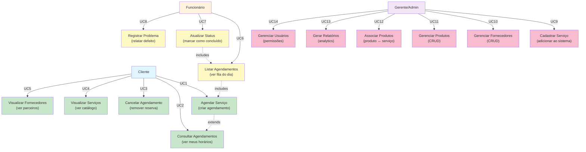

# 📊 Diagrama de Casos de Uso - Mermaid

## Como usar este código:

### Opção 1: Editor Online Mermaid (Recomendado - Fácil)
1. Acesse: https://mermaid.live
2. Cole o código abaixo na caixa esquerda
3. Veja a imagem gerada na direita
4. Clique em "Download SVG" ou "Download PNG"

### Opção 2: VS Code com Extensão
1. Instale: "Markdown Preview Mermaid Support"
2. Crie um arquivo `.md` com o código
3. Abra preview (Ctrl+Shift+V)
4. Clique com botão direito na imagem > "Export PNG"

### Opção 3: GitHub
1. Cole este código em um arquivo `.md` no GitHub
2. A imagem será renderizada automaticamente

---

## 🎯 DIAGRAMA DE CASOS DE USO - LAVACAR



---

## 📝 Explicação do Diagrama

### Atores:
- **Cliente** (Azul): Usuário que agenda serviços
- **Funcionário** (Laranja): Executa os serviços
- **Gerente/Admin** (Roxo): Gerencia sistema

### Casos de Uso por Ator:

#### Cliente (5 funções):
1. UC1: Agendar novo serviço
2. UC2: Ver seus agendamentos
3. UC3: Cancelar agendamento
4. UC4: Listar serviços disponíveis
5. UC5: Ver fornecedores parceiros

#### Funcionário (3 funções):
6. UC6: Ver agendamentos do dia
7. UC7: Marcar como concluído
8. UC8: Registrar problemas/defeitos

#### Admin/Gerente (6 funções):
9. UC9: Cadastrar novo serviço
10. UC10: Gerenciar fornecedores
11. UC11: Gerenciar produtos
12. UC12: Associar produtos a serviços
13. UC13: Gerar relatórios
14. UC14: Gerenciar usuários

### Relacionamentos:
- **→** = Ator usa caso de uso
- **-.->** = Relacionamento (extends/includes)

---

## 🎨 Customizações Possíveis

### Mudar cores:
Procure por `style Use1 fill:#c8e6c9` e altere:
- `#c8e6c9` = Verde claro
- `#fff9c4` = Amarelo claro
- `#f8bbd0` = Rosa claro
- `#e1f5ff` = Azul claro
- `#fff3e0` = Laranja claro
- `#f3e5f5` = Roxo claro

### Adicionar mais casos:
```mermaid
A -->|UC15| Use15["Novo Caso de Uso"]
```

### Mudar relacionamentos:
- `-->` = Uso normal
- `-.->` = Relacionamento especial
- `==>` = Dependência forte

---

## 💾 Próximos Passos

1. Copie o código acima (entre os ``` markers)
2. Acesse https://mermaid.live
3. Cole e ajuste conforme necessário
4. Exporte como PNG ou SVG
5. Adicione ao seu GitHub/Documentação

