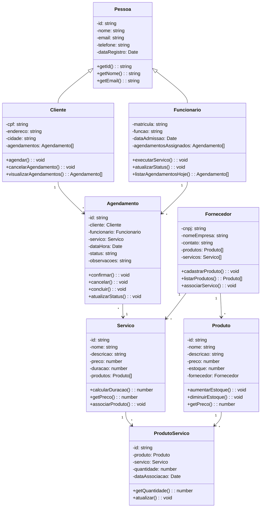

# 📐 Diagrama de Classes - Mermaid

## Como usar este código:

### Opção 1: Mermaid.live (Recomendado)
1. Acesse: https://mermaid.live
2. Cole o código abaixo
3. Exporte como PNG/SVG

### Opção 2: VS Code
1. Instale "Markdown Preview Mermaid Support"
2. Crie arquivo `.md` com o código
3. Abra preview (Ctrl+Shift+V)

---

## 🎯 DIAGRAMA DE CLASSES - LAVACAR



---

## 📝 Explicação das Classes

### Hierarquia:

#### Pessoa (Classe Base)
```
Pessoa (abstrata)
├── Cliente
└── Funcionário
```

### Entidades Principais:

#### **Pessoa** (Base para usuários)
- `id`: Identificador único
- `nome`: Nome da pessoa
- `email`: Email para contato
- `telefone`: Telefone
- `dataRegistro`: Quando se registrou

#### **Cliente** (Estende Pessoa)
- `cpf`: CPF brasileiro
- `endereco`: Endereço completo
- `cidade`: Cidade
- `agendamentos[]`: Lista de agendamentos

#### **Funcionario** (Estende Pessoa)
- `matricula`: ID funcional
- `funcao`: Cargo/função
- `dataAdmissao`: Data de contratação
- `agendamentosAssignados[]`: Serviços atribuídos

#### **Fornecedor** (Não estende Pessoa)
- `cnpj`: CNPJ da empresa
- `nomeEmpresa`: Nome comercial
- `contato`: Contato da empresa
- `produtos[]`: Produtos fornecidos
- `servicos[]`: Serviços oferecidos

#### **Produto** (Itens de estoque)
- `id`: Identificador único
- `nome`: Nome do produto
- `descricao`: Detalhe
- `preco`: Valor unitário
- `estoque`: Quantidade disponível
- `fornecedor`: Quem fornece

#### **Servico** (Serviços oferecidos)
- `id`: Identificador único
- `nome`: Nome do serviço
- `descricao`: Descrição
- `preco`: Valor cobrado
- `duracao`: Tempo em minutos
- `produtos[]`: Produtos utilizados

#### **ProdutoServico** (Associação muitos-para-muitos)
- `id`: Identificador único
- `produto`: Qual produto
- `servico`: Em qual serviço
- `quantidade`: Quanto é usado
- `dataAssociacao`: Quando foi criada

#### **Agendamento** (Reservas de serviços)
- `id`: Identificador único
- `cliente`: Quem agendou
- `funcionario`: Quem executará
- `servico`: Qual serviço
- `dataHora`: Quando será
- `status`: Estados (AGENDADO, CONFIRMADO, CONCLUÍDO, CANCELADO)
- `observacoes`: Notas especiais

---

## 🔗 Relacionamentos

### Herança (`<|--`)
- **Cliente** herda de Pessoa
- **Funcionário** herda de Pessoa

### Associações (`-->`)
- **Cliente** → **Agendamento** (1 cliente tem muitos agendamentos)
- **Funcionário** → **Agendamento** (1 funcionário executa muitos agendamentos)
- **Agendamento** → **Serviço** (1 agendamento é para 1 serviço)
- **Serviço** → **ProdutoServico** (1 serviço usa muitos produtos)
- **Produto** → **ProdutoServico** (1 produto pode estar em múltiplos serviços)
- **Fornecedor** → **Produto** (1 fornecedor fornece múltiplos produtos)
- **Fornecedor** → **Serviço** (1 fornecedor oferece múltiplos serviços)

---

## 🎨 Como Customizar

### Mudar tipos de dados:
```mermaid
-preco: number     →    -preco: decimal
-duracao: number   →    -duracao: int
```

### Adicionar mais métodos:
```mermaid
+novoMetodo(): void
+outroMetodo(): string
```

### Adicionar mais classes:
```mermaid
class MinhaClasse {
    -atributo: tipo
    +metodo(): void
}
```

---

## 💾 Alternativa: Código para PlantUML

Se preferir usar PlantUML, veja: `DIAGRAMA_CLASSES_PLANTUML.md`

---

## 🚀 Próximas Ações

1. Copie o código entre os ``` markers
2. Acesse https://mermaid.live
3. Cole e visualize
4. Ajuste conforme necessário
5. Exporte como imagem (PNG/SVG)
6. Adicione ao README e GitHub

