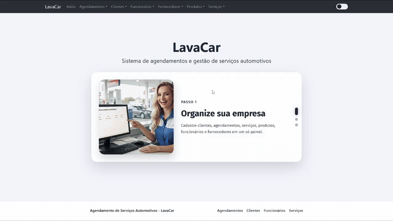

<div align="center">


<br>


Aplicação desenvolvida em **Angular 19**, com **IndexedDB**, suporte **PWA** e **completamente offline**.
<br><br>



</div>

<br>

## ✨ Recursos Principais

- ⚠️ **Atenção:** o sistema é para Desktop, não há responsividade total para Mobile
- ✅ **Agendamentos inteligentes:** com validação e status em tempo real  
- 👥 **Clientes e Funcionários:** cadastro completo com fotos  
- 🧼 **Serviços e Produtos:** integrados com controle de estoque  
- 🚚 **Fornecedores:** totalmente integrados  
- 🌗 **Tema Claro/Escuro:** personalizável  
- 📶 **Offline-First:** funciona sem internet e com sincronização automática


 

## ⚙️ Stack Tecnológico

| Tecnologia | Descrição |
|-------------|------------|
| 🅰️ **Angular 19** | Framework principal |
| 🧠 **TypeScript** | Linguagem base |
| 🎨 **Bootstrap 5** | UI responsiva |
| 💾 **Dexie.js** | IndexedDB wrapper |
| 🔔 **SweetAlert2** | Alertas personalizados |
| 🧩 **Angular CDK** | Drag & Drop |
| 🔄 **RxJS** | Programação reativa 

 

## 💡 Como Usar

1️⃣ **Cadastre Clientes e Funcionários**  
2️⃣ **Crie Serviços** e associe produtos  
3️⃣ **Agende atendimentos** com data, hora e responsável  
4️⃣ **Gerencie tudo em um só painel**, mesmo sem internet  

 
## 📋 Pré-requisitos

Antes de começar, verifique se você tem instalado:

- **Node.js** 18+ ([Download](https://nodejs.org/))
- **npm** 9+ (instalado com Node.js)
- **Git** ([Download](https://git-scm.com/))

### Verificar Instalação

```bash
node --version    # v18.0.0 ou superior
npm --version     # 9.0.0 ou superior
git --version     # git version 2.x.x
```
 
## 🚀 Instalação

### 1. Clone o Repositório

```bash
git clone https://github.com/ericdalaporta/lavacar-project.git
cd lavacar-project
```

### 2. Instale as Dependências

```bash
npm install
```

### 3. Inicie o Servidor de Desenvolvimento

```bash
npm start
```

A aplicação estará disponível em: **http://localhost:4200**

### 4. (Opcional) Build para Produção

```bash
npm run build
```

Os arquivos compilados serão gerados em `dist/lavacar-project/`


## 📧 Contato

**Desenvolvedor:** Eric Dala Porta  
**Email:** ericdasilvadalaporta@gmail.com  
