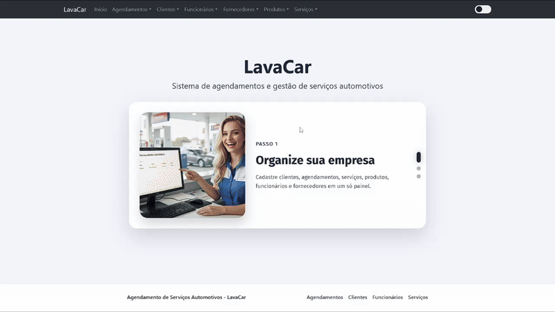

# 🚗 LavaCar - Sistema de Gerenciamento de Lava-Car

[](https://angular.io/)
[](https://www.typescriptlang.org/)
[](https://getbootstrap.com/)
[](https://dexie.org/)
[](LICENSE)

## 📺 Demonstração



---

## 📋 Sobre o Projeto

**LavaCar** é um sistema web completo e moderno desenvolvido em **Angular 19** para gerenciamento de lava-car. O projeto oferece uma solução integrada para controlar todos os aspectos operacionais de um negócio de lavagem de veículos, desde o cadastro de clientes até o agendamento de serviços.

### ✨ Características Principais

- 👥 **Gerenciamento de Clientes** - Cadastro, edição e exclusão de clientes
- 👨‍💼 **Gestão de Funcionários** - Controle de equipe com dados de admissão
- 🏢 **Cadastro de Fornecedores** - Gerenciamento de fornecedores de produtos
- 📦 **Controle de Produtos** - Inventário de produtos com vinculação a fornecedores
- 🛠️ **Serviços Oferecidos** - Catálogo de serviços com precificação
- 📅 **Sistema de Agendamentos** - Marcação de serviços com rastreamento de status
- 🎨 **Tema Claro/Escuro** - Interface adaptável ao gosto do usuário
- 🔒 **Armazenamento Local** - Dados persistidos com IndexedDB (sem servidor)
- ✅ **Validação em Tempo Real** - Formulários com feedback imediato
- 📱 **Design Responsivo** - Interface adaptada para desktop, tablet e mobile

---

## 🚀 Tecnologias Utilizadas

| Tecnologia | Versão | Descrição |
|------------|--------|-----------|
| **Angular** | 19.1.0 | Framework JavaScript para construção de SPAs |
| **TypeScript** | 5.7.2 | Superset do JavaScript com tipos estáticos |
| **Bootstrap** | 5.3.8 | Framework CSS para design responsivo |
| **Bootstrap Icons** | 1.13.1 | Biblioteca de ícones |
| **Dexie** | 4.2.0 | Wrapper para IndexedDB - banco de dados local |
| **SweetAlert2** | 11.23.0 | Alertas e diálogos modais elegantes |
| **RxJS** | 7.8.0 | Programação reativa em JavaScript |
| **Angular CDK** | 19.1.0 | Material componentes e utilidades |

---

## 📋 Pré-requisitos

Antes de iniciar, certifique-se de ter instalado:

- **Node.js** (versão 18 ou superior)
- **npm** (geralmente incluído com Node.js)
- **Git** (para clonar o repositório)
- Um navegador moderno (Chrome, Firefox, Safari ou Edge)

Verifique suas versões:
```bash
node --version
npm --version
```

---

## 🔧 Instalação

### 1️⃣ Clone o Repositório

```bash
git clone https://github.com/ericdalaporta/lavacar-project.git
cd lavacar-project
```

### 2️⃣ Instale as Dependências

```bash
npm install
```

### 3️⃣ Inicie o Servidor de Desenvolvimento

```bash
npm start
```

O projeto será aberto automaticamente em `http://localhost:4200/`

---

## 📝 Scripts Disponíveis

```bash
# 🚀 Iniciar servidor de desenvolvimento
npm start

# 🏗️ Build para produção
npm run build

# 👀 Build com watch (recompila ao detectar mudanças)
npm run watch

# 🧪 Executar testes unitários
npm test

# 📦 Build production otimizado
npm run build -- --configuration production
```

---

## 📁 Estrutura do Projeto

```
lavacar-project/
├── src/
│   ├── app/
│   │   ├── features/                    # ✨ Módulos principais
│   │   │   ├── clientes/                # Gerenciamento de clientes
│   │   │   │   ├── cadastro-cliente/
│   │   │   │   ├── listar-clientes/
│   │   │   │   └── services/
│   │   │   ├── funcionarios/            # Gestão de funcionários
│   │   │   │   ├── cadastro-funcionario/
│   │   │   │   ├── listar-funcionarios/
│   │   │   │   └── services/
│   │   │   ├── agendamentos/            # Sistema de agendamentos
│   │   │   │   ├── cadastro-agendamento/
│   │   │   │   ├── listar-agendamentos/
│   │   │   │   └── services/
│   │   │   └── servicos/                # Catálogo de serviços
│   │   │       ├── listar-servicos/
│   │   │       └── services/
│   │   ├── components/                  # 🎨 Componentes secundários
│   │   │   ├── fornecedores/
│   │   │   │   ├── cadastro-fornecedor/
│   │   │   │   ├── listar-fornecedor/
│   │   │   │   └── listar-produtos-fornecedor/
│   │   │   ├── produtos/
│   │   │   │   ├── cadastro-produto/
│   │   │   │   └── listar-produtos/
│   │   │   ├── services/
│   │   │   ├── header/                  # Navegação principal
│   │   │   ├── home/                    # Página inicial
│   │   │   └── cadastrar-fornecedor/
│   │   ├── shared/                      # 🔄 Recursos compartilhados
│   │   │   ├── components/
│   │   │   │   ├── layout/              # Layout principal
│   │   │   │   └── list-header/
│   │   │   └── services/
│   │   │       ├── mensagens.service.ts # Alertas e diálogos
│   │   │       └── theme.service.ts     # Tema claro/escuro
│   │   ├── models/                      # 📊 Modelos de dados
│   │   │   ├── pessoa.model.ts
│   │   │   ├── cliente.model.ts
│   │   │   ├── funcionario.model.ts
│   │   │   ├── fornecedor.model.ts
│   │   │   ├── produto.model.ts
│   │   │   ├── servico.model.ts
│   │   │   ├── agendamento.model.ts
│   │   │   └── produto-servico.model.ts
│   │   ├── core/                        # 🔧 Serviços centrais
│   │   │   └── services/
│   │   │       └── indexed-db.service.ts
│   │   ├── app.routes.ts                # Rotas da aplicação
│   │   ├── app.component.ts
│   │   └── app.config.ts
│   ├── assets/                          # 📁 Recursos estáticos
│   │   └── img/                         # Imagens e ícones
│   ├── styles.css                       # 🎨 Estilos globais
│   ├── index.html                       # HTML principal
│   └── main.ts                          # Ponto de entrada
├── package.json                         # Dependências do projeto
├── tsconfig.json                        # Configuração TypeScript
├── angular.json                         # Configuração Angular
└── README.md                            # Este arquivo
```

---

## 🏗️ Arquitetura do Sistema

### � Diagrama de Casos de Uso

```
                                    ┌─────────────────┐
                                    │  Administrador  │
                                    └────────┬────────┘
                                             │
                    ┌────────────────────────┼────────────────────────┐
                    │                        │                        │
                    ▼                        ▼                        ▼
        ┌─────────────────────┐  ┌─────────────────────┐  ┌────────────────────┐
        │ Gerenciar Clientes  │  │Gerenciar Funcionário│  │ Gerenciar Serviços │
        │  ├─ Cadastrar       │  │  ├─ Cadastrar      │  │  ├─ Cadastrar      │
        │  ├─ Listar          │  │  ├─ Listar         │  │  ├─ Listar         │
        │  ├─ Editar          │  │  ├─ Editar         │  │  ├─ Editar         │
        │  └─ Remover         │  │  └─ Remover        │  │  └─ Remover        │
        └─────────────────────┘  └─────────────────────┘  └────────────────────┘
                    │                        │                        │
                    │                        │        ┌────────────────┤
                    │                        │        │                │
                    │                        └────────┼────────────────┼────────────┐
                    │                                 │                │            │
                    │                    ┌────────────▼──────────┐    │            │
                    │                    │ Agendar Serviço       │    │            │
                    │                    │  ├─ Criar Agendamento│    │            │
                    │                    │  ├─ Visualizar       │    │            │
                    │                    │  ├─ Editar           │    │            │
                    │                    │  └─ Remover          │    │            │
                    │                    └────────────┬──────────┘    │            │
                    │                                 │                │            │
                    ▼                                 ▼                ▼            ▼
        ┌─────────────────────────────────────────────────────────────────────────────┐
        │                          Sistema de Agendamento                             │
        │  ├─ Validação de Cliente                                                   │
        │  ├─ Validação de Funcionário Disponível                                    │
        │  ├─ Confirmação de Serviço e Preço                                         │
        │  ├─ Rastreamento de Status (Pendente → Confirmado → Concluído/Cancelado)  │
        │  └─ Histórico de Agendamentos                                              │
        └─────────────────────────────────────────────────────────────────────────────┘

        ┌─────────────────────────────────────────────────────────────────────────────┐
        │                          Módulo Administrativo                              │
        │  ├─ Gerenciar Fornecedores                                                  │
        │  ├─ Gerenciar Produtos (com vínculo a Fornecedores)                         │
        │  ├─ Associar Produtos a Serviços                                            │
        │  └─ Relatórios de Inventário                                                │
        └─────────────────────────────────────────────────────────────────────────────┘
```

---

## �️ Diagrama de Classes

```
                              ┌─────────────────────┐
                              │      Pessoa         │
                              ├─────────────────────┤
                              │ - id?: number       │
                              │ - nome: string      │
                              │ - telefone: string  │
                              │ - email: string     │
                              │ - foto: string      │
                              └──────────┬──────────┘
                                         │
                 ┌───────────────────────┴───────────────────────┐
                 │                                               │
                 ▼                                               ▼
        ┌──────────────────────┐                      ┌──────────────────────┐
        │     Cliente          │                      │    Funcionario       │
        ├──────────────────────┤                      ├──────────────────────┤
        │ - endereco: string   │                      │ - funcao: string     │
        │ - id?: number        │                      │ - dataAdmissao: Date │
        │                      │                      │ - id?: number        │
        │ + adicionar()        │                      │                      │
        │ + obterTodos()       │                      │ + adicionar()        │
        │ + obterPorId(id)     │                      │ + obterTodos()       │
        │ + atualizar()        │                      │ + obterPorId(id)     │
        │ + remover(id)        │                      │ + atualizar()        │
        └──────────────────────┘                      │ + remover(id)        │
                                                     └──────────────────────┘

        ┌──────────────────────┐                      ┌──────────────────────┐
        │    Fornecedor        │                      │      Produto         │
        ├──────────────────────┤                      ├──────────────────────┤
        │ - id?: number        │◄─────────────────────│ - id?: number        │
        │ - nome: string       │   fornecedorId       │ - nome: string       │
        │ - cnpj: string       │                      │ - preco: number      │
        │ - fone: string       │                      │ - quantidade: number │
        │ - ordem?: number     │                      │ - ordem?: number     │
        │                      │                      │                      │
        │ + adicionar()        │                      │ + adicionar()        │
        │ + obterTodos()       │                      │ + obterTodos()       │
        │ + obterPorId(id)     │                      │ + obterPorId(id)     │
        │ + atualizar()        │                      │ + atualizar()        │
        │ + remover(id)        │                      │ + remover(id)        │
        └──────────────────────┘                      └──────────────────────┘

        ┌──────────────────────────┐                  ┌──────────────────────────┐
        │      Servico             │                  │   ProdutoServico         │
        ├──────────────────────────┤                  ├──────────────────────────┤
        │ - id?: number            │◄─────┐          │ - id?: number            │
        │ - nome: string           │      │servico   │ - servicoId: number      │
        │ - descricao: string      │      │    ├────►│ - produtoId: number      │
        │ - preco: number          │      │          │ - quantidade: number     │
        │ - ordem: number          │      │          │ - ordem?: number         │
        │                          │      │          │                          │
        │ + adicionar()            │      │          │ + adicionar()            │
        │ + obterTodos()           │      │          │ + obterTodos()           │
        │ + obterPorId(id)         │      │          │ + obterPorId(id)         │
        │ + atualizar()            │      │          │ + atualizar()            │
        │ + remover(id)            │      │          │ + remover(id)            │
        └──────────────────────────┘      │          └──────────────────────────┘
                      ▲                   │                      ▲
                      │                   │                      │
                      └───────────────────┼──────────────────────┘
                                          └─────► Produto

        ┌──────────────────────────────────┐
        │      Agendamento                 │
        ├──────────────────────────────────┤
        │ - id?: number                    │
        │ - clienteId: number              │◄────── Cliente
        │ - funcionarioId: number          │◄────── Funcionario
        │ - servicoId: number              │◄────── Servico
        │ - data: string                   │
        │ - hora: string                   │
        │ - status: StatusAgendamento      │
        │ - observacoes: string            │
        │ - ordem: number                  │
        │                                  │
        │ + adicionar()                    │
        │ + obterTodos()                   │
        │ + obterPorId(id)                 │
        │ + atualizar()                    │
        │ + remover(id)                    │
        │ + filtrarPorStatus()             │
        │ + gerarRelatorio()               │
        └──────────────────────────────────┘

        ┌──────────────────────────────────────────────────────┐
        │           Serviço Central de Dados                   │
        │         IndexedDbService                            │
        ├──────────────────────────────────────────────────────┤
        │ - stores: Map<string, ObjectStore>                   │
        │                                                      │
        │ + adicionar(store, objeto)                           │
        │ + obterTodos(store)                                  │
        │ + obterPorId(store, id)                              │
        │ + atualizar(store, objeto)                           │
        │ + remover(store, id)                                 │
        │ + limpar(store)                                      │
        │ + exportarDados()                                    │
        │ + importarDados(dados)                               │
        └──────────────────────────────────────────────────────┘
```

---

## 🎨 Interface e UX

### Tema Claro
- Cores claras e naturais
- Fácil leitura em ambientes bem iluminados
- Padrão de design moderno e limpo

### Tema Escuro
- Reduz fadiga visual em ambientes com pouca luz
- Cores mais suaves e agradáveis
- Transição suave entre temas

### Responsividade
- ✅ Desktop (1920px+)
- ✅ Tablet (768px - 1024px)
- ✅ Mobile (até 768px)

---

## 🔄 Fluxo de Agendamento

```
┌─────────────────────────────────────────────────────────────────┐
│                    Novo Agendamento                              │
└────────────────────────┬────────────────────────────────────────┘
                         │
                         ▼
        ┌─────────────────────────────────┐
        │  1. Selecionar Cliente          │
        │     └─ Buscar ou criar novo     │
        └────────────┬────────────────────┘
                     │
                     ▼
        ┌─────────────────────────────────┐
        │  2. Escolher Funcionário        │
        │     └─ Verificar disponibilidade│
        └────────────┬────────────────────┘
                     │
                     ▼
        ┌─────────────────────────────────┐
        │  3. Selecionar Serviço          │
        │     └─ Visualizar preço         │
        └────────────┬────────────────────┘
                     │
                     ▼
        ┌─────────────────────────────────┐
        │  4. Agendar Data e Hora         │
        │     └─ Validar conflitos        │
        └────────────┬────────────────────┘
                     │
                     ▼
        ┌─────────────────────────────────┐
        │  5. Adicionar Observações       │
        │     (opcional)                  │
        └────────────┬────────────────────┘
                     │
                     ▼
        ┌─────────────────────────────────┐
        │  6. Revisar Informações         │
        └────────────┬────────────────────┘
                     │
         ┌───────────┴────────────┐
         │                        │
         ▼                        ▼
    ┌─────────┐            ┌──────────┐
    │ Confirmar│            │  Cancelar │
    └────┬────┘            └──────────┘
         │
         ▼
┌──────────────────────────────────────┐
│ Agendamento Criado com Sucesso! ✅   │
│ Status: Pendente                     │
│ (Aguardando confirmação)             │
└──────────────────────────────────────┘
         │
         ├────────────────┬────────────────┐
         ▼                ▼                ▼
    ┌────────┐       ┌──────────┐    ┌──────────┐
    │Confirmar│       │  Alterar  │    │ Cancelar │
    │         │       │           │    │          │
    │Status:  │       │Status:    │    │Status:   │
    │Confirmad│       │Pendente→  │    │Cancelado │
    │         │       │Confirmado │    │          │
    └────────┘       └──────────┘    └──────────┘
         │                 │               │
         ▼                 ▼               ▼
    ┌──────────────────────────────────────────┐
    │      Agendamento em Processamento        │
    │   Aguardando data/hora do serviço        │
    └──────────────────────────────────────────┘
         │
         └─► Status: Concluído (após data/hora)
         └─► Status: Cancelado (se cancelar)
```

---

## � Armazenamento de Dados

O projeto utiliza **IndexedDB** para armazenamento local de dados, o que significa:

✅ **Vantagens:**
- Dados persistem no navegador
- Sem necessidade de servidor
- Rápido acesso aos dados
- Suporta grandes volumes de dados

⚠️ **Limitações:**
- Dados específicos de cada navegador
- Não sincroniza entre dispositivos
- Limpeza do cache/histórico pode remover dados

### Estrutura do IndexedDB

```
Database: LavaCarDB
├── Store: clientes
│   └── Index: id (primary), nome, email
├── Store: funcionarios
│   └── Index: id (primary), nome, funcao
├── Store: fornecedores
│   └── Index: id (primary), nome, cnpj
├── Store: produtos
│   └── Index: id (primary), nome, fornecedorId
├── Store: servicos
│   └── Index: id (primary), nome
├── Store: agendamentos
│   └── Index: id (primary), clienteId, funcionarioId, data
└── Store: produtoServicos
    └── Index: id (primary), servicoId, produtoId
```

---

## 🧪 Testes

O projeto inclui testes unitários para componentes e serviços.

### Executar Testes

```bash
npm test
```

### Estrutura de Testes

```
src/
├── app/
│   ├── models/
│   │   ├── *.model.spec.ts
│   ├── services/
│   │   ├── *.service.spec.ts
│   └── features/
│       └── **/
│           └── *.component.spec.ts
```

---

## � Documentação de Componentes

### ClienteService

Gerencia operações CRUD para clientes.

```typescript
// Adicionar cliente
const cliente = new Cliente('Rua X', 'João', '11999999999', 'joao@email.com');
const id = await clienteService.adicionar(cliente);

// Obter todos
const clientes = await clienteService.obterTodos();

// Obter por ID
const cliente = await clienteService.obterPorId(1);

// Atualizar
cliente.nome = 'João Silva';
await clienteService.atualizar(cliente);

// Remover
await clienteService.remover(1);
```

### AgendamentoService

Gerencia agendamentos com validações de conflito.

```typescript
// Criar agendamento
const agendamento = new Agendamento(
  clienteId,
  funcionarioId,
  servicoId,
  '2025-10-20',
  '10:30'
);
const id = await agendamentoService.adicionar(agendamento);

// Listar agendamentos de um cliente
const agendamentos = await agendamentoService.obterTodos();
```

---

## 🎯 Funcionalidades por Versão

### v1.0.0 (Atual)
- ✅ Gerenciamento de Clientes
- ✅ Gestão de Funcionários
- ✅ Cadastro de Fornecedores
- ✅ Controle de Produtos
- ✅ Catálogo de Serviços
- ✅ Sistema de Agendamentos
- ✅ Tema Claro/Escuro
- ✅ Validação em Tempo Real
- ✅ Interface Responsiva

### Roadmap (Futuras Versões)
- 🔄 Sincronização com Backend
- 📊 Relatórios e Análises
- 📧 Notificações por Email
- 📱 App Mobile (React Native)
- 💳 Integração com Pagamentos
- 📍 Mapa de Localização
- 🔐 Autenticação de Usuários

---

## 🐛 Troubleshooting

### Problema: Aplicação não inicia

```bash
# Limpe cache e reinstale dependências
rm -rf node_modules package-lock.json
npm install
npm start
```

### Problema: Dados não aparecem

- Verifique o console do navegador (F12)
- Abra DevTools → Application → IndexedDB
- Verifique se o store existe
- Tente limpar o cache: Ctrl+Shift+Delete

### Problema: Tema não funciona

```bash
# Recompile o projeto
npm run build
npm start
```

---

## 🤝 Como Contribuir

Contribuições são bem-vindas! Siga estes passos:

1. **Fork** o projeto
2. **Crie uma branch** para sua feature (`git checkout -b feature/MinhaFeature`)
3. **Commit** suas mudanças (`git commit -m 'feat: adiciona MinhaFeature'`)
4. **Push** para a branch (`git push origin feature/MinhaFeature`)
5. **Abra um Pull Request**

### Padrões de Commit

- `feat:` Nova funcionalidade
- `fix:` Correção de bug
- `docs:` Mudanças na documentação
- `style:` Formatação de código
- `refactor:` Refatoração de código
- `perf:` Melhorias de performance
- `test:` Testes

---

## � Licença

Este projeto está licenciado sob a **Licença MIT** - veja o arquivo [LICENSE](LICENSE) para detalhes.

---

## 📞 Contato

- **Email:** ericdasilvadalaporta@gmail.com
- **GitHub:** [@ericdalaporta](https://github.com/ericdalaporta)

Para dúvidas, sugestões ou reportar bugs, entre em contato através do email acima.

---

## 🙏 Agradecimentos

- [Angular Community](https://angular.io/)
- [Bootstrap](https://getbootstrap.com/)
- [Dexie.js](https://dexie.org/)
- Todos os contribuidores

---

## 📊 Estatísticas do Projeto

- **Componentes:** 15+
- **Serviços:** 10+
- **Modelos de Dados:** 8
- **Rotas:** 20+
- **Linhas de Código:** 5000+

---

<div align="center">

### ⭐ Se este projeto foi útil, considere dar uma estrela!

**Desenvolvido com ❤️ por [Eric da Silva da Porta](https://github.com/ericdalaporta)**

**Última Atualização:** Outubro 2025

</div>

---

## 📖 Recursos Adicionais

- [Documentação do Angular 19](https://angular.io/docs)
- [Guia do Bootstrap 5](https://getbootstrap.com/docs/5.3)
- [Documentação Dexie](https://dexie.org/docs)
- [MDN Web Docs - IndexedDB](https://developer.mozilla.org/en-US/docs/Web/API/IndexedDB_API)

✅ **Em produção e totalmente padronizado!**

O projeto foi recentemente padronizado seguindo as melhores práticas do Angular 19.
Consulte [RELATORIO_PADRONIZACAO.md](./RELATORIO_PADRONIZACAO.md) para mais detalhes.

## 🛠️ Tecnologias

- **Angular 19.1.0** - Framework principal
- **TypeScript 5.7.2** - Linguagem de programação
- **Bootstrap 5.3.8** - Framework CSS
- **Dexie 4.2.0** - Banco de dados IndexedDB
- **SweetAlert2** - Alertas e modais
- **Bootstrap Icons** - Ícones

## 📦 Pré-requisitos

- Node.js (versão 18 ou superior)
- npm ou yarn
- Angular CLI

## 🔧 Instalação

```bash
# Clone o repositório
git clone <url-do-repositorio>

# Entre na pasta do projeto
cd lavacar-project-main

# Instale as dependências
npm install

# Execute o projeto
npm start
```

O projeto estará disponível em `http://localhost:4200/`

## 📝 Scripts Disponíveis

```bash
# Iniciar servidor de desenvolvimento
npm start

# Build de produção
npm run build

# Build com watch (desenvolvimento)
npm run watch

# Executar testes
npm test
```

## 📁 Estrutura do Projeto

```
src/
├── app/
│   ├── components/          # Componentes da aplicação
│   │   ├── fornecedores/    # Módulo de fornecedores
│   │   ├── produtos/        # Módulo de produtos
│   │   ├── services/        # Módulo de serviços
│   │   └── home/            # Página inicial
│   ├── models/              # Interfaces de dados
│   ├── services/            # Serviços (lógica de negócio)
│   └── shared/              # Componentes compartilhados
│       └── components/
│           └── layout/      # Header, Footer, etc.
├── styles.css               # Estilos globais
└── index.html               # HTML principal
```

## 📚 Documentação

O projeto possui documentação completa:

- **[PADRONIZACAO.md](./PADRONIZACAO.md)** - Histórico de padronizações aplicadas
- **[STYLE_GUIDE.md](./STYLE_GUIDE.md)** - Guia de estilo e convenções de código
- **[CHECKLIST.md](./CHECKLIST.md)** - Checklist para desenvolvimento
- **[RELATORIO_PADRONIZACAO.md](./RELATORIO_PADRONIZACAO.md)** - Relatório completo das mudanças

## 🎯 Funcionalidades

### Fornecedores
- ✅ Cadastro de fornecedores
- ✅ Listagem com paginação e filtro
- ✅ Edição e exclusão
- ✅ Visualização de produtos por fornecedor

### Produtos
- ✅ Cadastro de produtos
- ✅ Listagem de produtos
- ✅ Edição e exclusão
- ✅ Vínculo com fornecedores

### Serviços
- ✅ Cadastro de serviços
- ✅ Listagem de serviços
- ✅ Edição e exclusão
- ✅ Associação de produtos

## 🎨 Padrões de Código

O projeto segue padrões rigorosos de código:

### Componentes
```typescript
@Component({
  selector: 'app-nome',
  standalone: true,
  imports: [CommonModule],
  templateUrl: './nome.component.html',
  styleUrl: './nome.component.css'  // singular!
})
```

### Serviços (Métodos CRUD)
- `add()` - Criar registro
- `getAll()` - Listar todos
- `getById(id)` - Buscar por ID
- `update()` - Atualizar registro
- `delete(id)` - Excluir registro

### Modelos
```typescript
export interface NomeModel {
  id?: number;
  campo: string;
}
```

Para mais detalhes, consulte [STYLE_GUIDE.md](./STYLE_GUIDE.md)

## 🤝 Contribuindo

1. Fork o projeto
2. Crie uma branch para sua feature (`git checkout -b feature/MinhaFeature`)
3. Siga o [STYLE_GUIDE.md](./STYLE_GUIDE.md)
4. Use o [CHECKLIST.md](./CHECKLIST.md) antes de commitar
5. Commit suas mudanças (`git commit -m 'feat: adiciona MinhaFeature'`)
6. Push para a branch (`git push origin feature/MinhaFeature`)
7. Abra um Pull Request

## 📄 Licença

Este projeto está sob a licença MIT. Veja o arquivo [LICENSE](LICENSE) para mais detalhes.

## 👨‍💻 Desenvolvimento

### Comandos Úteis

```bash
# Gerar novo componente
ng generate component nome-componente

# Gerar novo serviço
ng generate service nome-servico

# Verificar versão do Angular
ng version
```

### Build

```bash
# Build de desenvolvimento
npm run build

# Build de produção
npm run build -- --configuration production
```

## 🐛 Reportar Bugs

Encontrou um bug? Por favor, abra uma issue descrevendo:
1. Passos para reproduzir
2. Comportamento esperado
3. Comportamento atual
4. Screenshots (se aplicável)

## 📞 Suporte

Para dúvidas sobre padrões de código, consulte:
1. [STYLE_GUIDE.md](./STYLE_GUIDE.md) - Guia completo de estilo
2. [CHECKLIST.md](./CHECKLIST.md) - Checklist de desenvolvimento
3. Exemplos nos componentes existentes

---

**Gerado com** [Angular CLI](https://github.com/angular/angular-cli) **versão 19.1.7**

**Última atualização**: Outubro 2025
